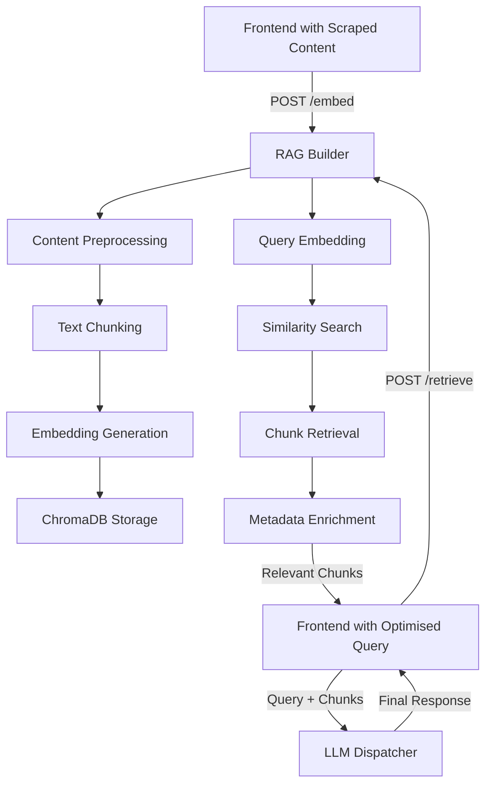
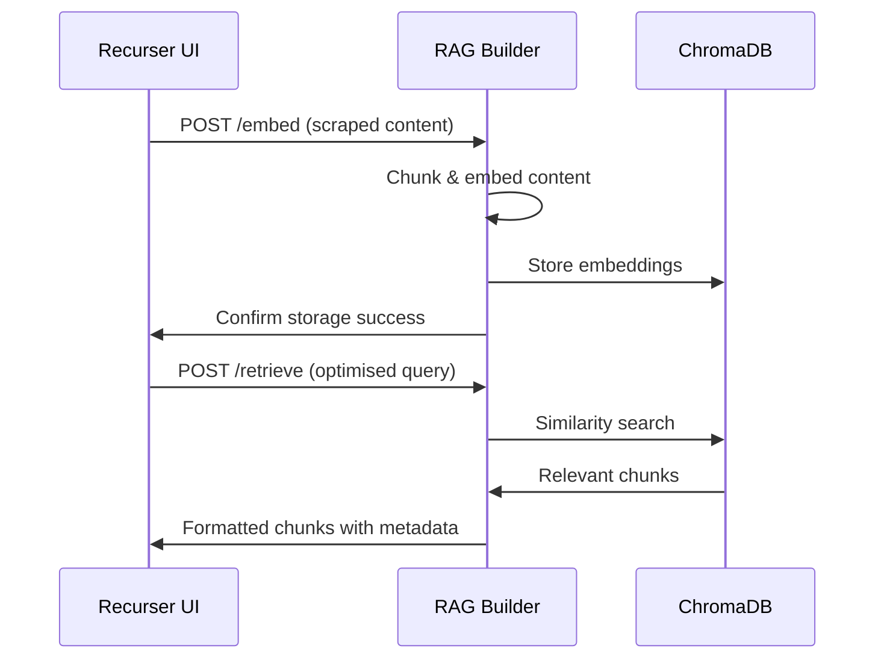

# RAG Builder Architecture

## Overview

The RAG Builder is a critical component in the Recurser application that implements Retrieval-Augmented Generation (RAG) functionality. It processes scraped web content, creates searchable embeddings, and provides intelligent chunk retrieval to enhance LLM responses with relevant context.

## Purpose & Responsibilities

### Core Functions
- **Content Processing**: Receive and process scraped content from web crawler
- **Text Chunking**: Break down large content into semantically meaningful chunks
- **Embedding Generation**: Create vector representations of text chunks for similarity search
- **Vector Storage**: Store embeddings and metadata in ChromaDB vector database
- **Similarity Retrieval**: Find most relevant chunks based on optimised queries
- **Context Assembly**: Return relevant chunks with metadata for LLM augmentation

### Position in System Architecture
The RAG Builder serves as the knowledge processing and retrieval hub:
- **Input Sources**: Receives scraped content from crawler (via frontend)
- **Query Sources**: Receives optimised queries from optimiser (via frontend)  
- **Output Target**: Returns relevant chunks to frontend for final LLM dispatcher call

---

## Current Implementation Analysis

### Existing Features ✅
- Flask-based REST API framework
- Health monitoring for ChromaDB and Ollama services
- Basic LLM query interface (Ollama integration)
- API documentation endpoint
- Docker containerisation

### Missing Core RAG Features ❌
- **Document Processing Pipeline**: Content ingestion and preprocessing
- **Text Chunking Engine**: Intelligent content segmentation
- **Embedding Generation**: Vector creation from text chunks
- **ChromaDB Integration**: Vector storage and retrieval operations
- **Similarity Search**: Query-to-chunk matching functionality
- **Metadata Management**: Source tracking and filtering

### Required Dependencies ✅
Updated in `requirements.txt`:
```python
chromadb>=0.4.22          # Vector database client
sentence-transformers>=2.2.2  # Local embedding models
tiktoken>=0.5.0           # Token counting for chunking
numpy>=1.24.0             # Vector operations
```

---

## Proposed System Architecture

### Data Flow Pipeline



### API Endpoint Design

#### Content Ingestion
```http
POST /embed
```
**Purpose**: Process and store scraped content  
**Request Format**:
```json
{
  "session_id": "unique-search-session",
  "query": "original-search-query",
  "documents": [
    {
      "url": "https://example.com/article",
      "title": "Article Title",
      "content": "Full scraped text content...",
      "timestamp": "2024-01-01T12:00:00Z",
      "metadata": {
        "search_rank": 1,
        "domain": "example.com"
      }
    }
  ]
}
```

**Response Format**:
```json
{
  "session_id": "unique-search-session",
  "chunks_created": 45,
  "embeddings_stored": 45,
  "processing_time": 2.5,
  "collection_id": "session_abc123",
  "summary": {
    "total_tokens": 12500,
    "average_chunk_size": 278,
    "documents_processed": 10
  }
}
```

#### Chunk Retrieval
```http
POST /retrieve
```
**Purpose**: Find relevant chunks for optimised query  
**Request Format**:
```json
{
  "session_id": "unique-search-session",
  "query": "optimised-search-query",
  "max_chunks": 5,
  "similarity_threshold": 0.7,
  "metadata_filters": {
    "domains": ["example.com", "wikipedia.org"],
    "max_age_hours": 24
  }
}
```

**Response Format**:
```json
{
  "query": "optimised-search-query",
  "chunks": [
    {
      "content": "Relevant text chunk content...",
      "score": 0.92,
      "source": {
        "url": "https://example.com/article",
        "title": "Article Title",
        "position": "paragraph_3"
      },
      "metadata": {
        "tokens": 156,
        "search_rank": 1,
        "timestamp": "2024-01-01T12:00:00Z"
      }
    }
  ],
  "total_chunks_searched": 450,
  "retrieval_time": 0.3
}
```

#### Collection Management
```http
GET /collections
POST /collections/{collection_id}/clear
DELETE /collections/{collection_id}
```

#### Health & Monitoring
```http
GET /health
GET /metrics
```

---

## Text Chunking Strategy

### Hybrid Chunking Approach

#### 1. **Semantic Chunking** (Primary)
- Preserve paragraph and sentence boundaries
- Maintain context within chunks
- Respect document structure (headers, lists, etc.)

#### 2. **Token-Based Limits** (Primary)
- **Target chunk size: 512 tokens** (optimal for embedding models and retrieval)
- **Min chunk size: 100 tokens** (avoid tiny fragments)
- **Max chunk size: 800 tokens** (hard limit for quality)
- **Overlap: 50 tokens** between adjacent chunks (preserves context)

#### 3. **Unified Chunking Strategy** (MVP Approach)
```python
CHUNK_CONFIG = {
    "target_tokens": 512,        # Optimal size for most content
    "min_tokens": 100,           # Skip tiny fragments  
    "max_tokens": 800,           # Hard quality limit
    "overlap_tokens": 50,        # Context preservation
    "preserve_sentences": True,   # Don't break mid-sentence
    "preserve_paragraphs": True   # Prefer paragraph boundaries
}
```

### Preprocessing Pipeline
1. **Content Sanitisation**: Remove ads, navigation, boilerplate
2. **Text Normalisation**: Handle encoding, whitespace, special characters
3. **Structure Detection**: Identify headers, lists, code blocks
4. **Content Classification**: Determine optimal chunking strategy
5. **Intelligent Splitting**: Apply strategy-specific chunking rules

---

## Embedding Strategy

### Multi-Model Support

#### Local Embeddings (Primary)
```python
EMBEDDING_MODELS = {
    "default": "all-MiniLM-L6-v2",     # Fast, good quality
    "high_quality": "all-mpnet-base-v2", # Better quality, slower
    "multilingual": "paraphrase-multilingual-MiniLM-L12-v2"
}
```

#### External Embeddings (Fallback)
- OpenAI `text-embedding-ada-002`
- Anthropic Claude embeddings (future)

### Embedding Pipeline
1. **Text Preprocessing**: Clean and normalise chunk text
2. **Model Selection**: Choose based on performance requirements
3. **Batch Processing**: Process multiple chunks efficiently
4. **Vector Normalisation**: Ensure consistent similarity calculations
5. **Quality Validation**: Check embedding dimensions and values

---

## ChromaDB Integration

### Collection Design

#### Collection Naming Strategy
```python
COLLECTION_PATTERNS = {
    "session": "session_{session_id}",      # Per-search session
    "persistent": "knowledge_base",         # Long-term storage
    "temporal": "temp_{timestamp}"          # Auto-cleanup collections
}
```

#### Metadata Schema (Future Enhancement)

**MVP Approach**: Basic metadata only, with skeleton functions for future enhancement.

```python
# CURRENT IMPLEMENTATION (MVP)
BASIC_METADATA = {
    "session_id": str,          # Link to search session
    "source_url": str,          # Source URL  
    "chunk_index": int,         # Position in document
    "chunk_id": str             # Unique identifier
}

# FUTURE ENHANCEMENT (Skeleton included but not used)
EXTENDED_METADATA = {
    "document_title": str,      # Page title
    "search_rank": int,         # Original search result rank
    "timestamp": str,           # When processed
    "domain": str,              # Source domain
    "content_type": str,        # news, blog, wiki, etc.
    "language": str,            # Detected language
    "token_count": int          # Actual chunk size
}
```

**Note**: Extended metadata functions will be included as skeleton code but not actively used until other modules can provide this data reliably.

### Database Operations

#### Storage Operations
```python
async def store_chunks(session_id: str, chunks: List[dict]):
    collection = get_or_create_collection(session_id)
    embeddings = await generate_embeddings([chunk["content"] for chunk in chunks])
    
    collection.add(
        embeddings=embeddings,
        documents=[chunk["content"] for chunk in chunks],
        metadatas=[chunk["metadata"] for chunk in chunks],
        ids=[generate_chunk_id(chunk) for chunk in chunks]
    )
```

#### Retrieval Operations
```python
async def retrieve_chunks(session_id: str, query: str, max_results: int = 5):
    collection = get_collection(session_id)
    query_embedding = await generate_embedding(query)
    
    results = collection.query(
        query_embeddings=[query_embedding],
        n_results=max_results,
        include=["documents", "metadatas", "distances"]
    )
    
    return format_retrieval_results(results)
```

---

## Performance Optimisation

### Batch Processing
- **Embedding Generation**: Process multiple chunks simultaneously
- **Database Operations**: Bulk insert and query operations
- **Preprocessing**: Parallel content processing

### Caching Strategy
```python
CACHE_LAYERS = {
    "embeddings": "Redis cache for frequently accessed embeddings",
    "chunks": "In-memory cache for recent chunk retrievals", 
    "metadata": "Database-level caching for collection info"
}
```

### Resource Management
- **Memory Usage**: Monitor embedding model memory consumption
- **Disk Space**: Implement collection cleanup policies
- **CPU Usage**: Balance between speed and resource usage

---

## Configuration Management

### Environment Variables

#### Core Settings
```bash
# Service Configuration
RAG_BUILDER_PORT=5300
RAG_BUILDER_HOST=0.0.0.0

# ChromaDB Settings
CHROMA_HOST=chromadb
CHROMA_PORT=8000
CHROMA_PERSIST_DIRECTORY=/data/chroma

# Embedding Configuration
EMBEDDING_MODEL=all-MiniLM-L6-v2
EMBEDDING_PROVIDER=local  # local|openai
EMBEDDING_BATCH_SIZE=32

# Chunking Configuration
CHUNK_TARGET_TOKENS=512
CHUNK_MIN_TOKENS=100
CHUNK_MAX_TOKENS=800
CHUNK_OVERLAP_TOKENS=50
MAX_CHUNKS_PER_DOCUMENT=50

# Performance Settings
MAX_CONCURRENT_EMBEDDINGS=4
CACHE_TTL_SECONDS=3600
CLEANUP_INTERVAL_HOURS=24
```

#### Provider-Specific Settings
```bash
# OpenAI (if using external embeddings)
OPENAI_API_KEY=your-api-key
OPENAI_EMBEDDING_MODEL=text-embedding-ada-002

# Ollama (for local embeddings)
OLLAMA_HOST=llm
OLLAMA_PORT=11434
OLLAMA_EMBEDDING_MODEL=nomic-embed-text
```

---

## Error Handling & Resilience

### Error Categories

#### 1. **Content Processing Errors**
- Invalid or corrupted input content
- Unsupported content types
- Memory limitations for large documents

#### 2. **Embedding Generation Errors**
- Model loading failures
- Out of memory conditions
- Network issues (external providers)

#### 3. **Database Operations Errors**
- ChromaDB connection failures
- Collection creation/access issues
- Storage capacity limitations

#### 4. **Retrieval Errors**
- Query processing failures
- No relevant chunks found
- Similarity threshold too restrictive

### Resilience Strategies

#### Graceful Degradation
```python
FALLBACK_STRATEGIES = {
    "embedding_failure": "Use cached embeddings or simpler model",
    "db_unavailable": "Return error with retry guidance",
    "chunking_error": "Fall back to simple text splitting",
    "retrieval_failure": "Return empty results with explanation"
}
```

#### Retry Logic
```python
RETRY_CONFIGS = {
    "embedding_generation": {"max_retries": 3, "backoff": "exponential"},
    "db_operations": {"max_retries": 5, "backoff": "linear"},
    "external_apis": {"max_retries": 2, "backoff": "exponential"}
}
```

---

## Security Considerations

### Input Validation
- **Content Sanitisation**: Remove malicious scripts and content
- **Size Limits**: Prevent memory exhaustion attacks
- **Rate Limiting**: Protect against abuse

### Data Privacy
- **Temporary Storage**: Automatic cleanup of session data
- **Metadata Filtering**: Remove sensitive information from URLs
- **Access Control**: Session-based access to collections

### API Security
- **Input Validation**: Strict request schema validation
- **Authentication**: API key or token-based access (future)
- **Audit Logging**: Track all operations for security monitoring

---

## Development Roadmap

### Phase 1: Core RAG Implementation ⏳ (Next)
- [ ] **Text Chunking Pipeline**
  - Implement 512-token chunking with 50-token overlap
  - Add sentence boundary preservation
  - Create token counting with tiktoken

- [ ] **Embedding Integration**
  - Add sentence-transformers with `all-MiniLM-L6-v2` model
  - Implement batch processing for performance
  - Add embedding generation for both storage and retrieval

- [ ] **ChromaDB Operations**
  - Complete vector storage with session-based collections
  - Add similarity search functionality
  - Implement basic metadata storage (session_id, source_url, chunk_index)

- [ ] **API Development**
  - Implement `/embed` endpoint for content processing
  - Implement `/retrieve` endpoint for chunk retrieval
  - Add comprehensive error handling and input validation

- [ ] **Metadata Skeleton** 
  - Include extended metadata functions for future use
  - Implement basic metadata only for MVP
  - Prepare for future enhancement when other modules provide rich metadata

### Phase 2: Performance & Scalability (Soon)
- [ ] **Optimisation Features**
  - Implement caching layers for embeddings
  - Add parallel processing for large documents
  - Optimise memory usage for large collections

- [ ] **Advanced Chunking**
  - Add document structure awareness
  - Implement content-type specific strategies
  - Add overlap optimisation algorithms

- [ ] **Enhanced Retrieval**
  - Add hybrid search (semantic + keyword)
  - Implement re-ranking algorithms
  - Add query expansion techniques

### Phase 3: Production Features (Later)
- [ ] **Enterprise Capabilities**
  - Multi-tenancy support
  - Advanced security features
  - Comprehensive monitoring and metrics

- [ ] **Integration Enhancements**
  - Support for additional embedding providers
  - Custom embedding model training
  - Advanced metadata filtering

- [ ] **Scalability Improvements**
  - Distributed processing support
  - Auto-scaling based on load
  - Advanced caching strategies

### Phase 4: AI Enhancement (Future)
- [ ] **Intelligent Features**
  - Automatic chunk quality assessment
  - Dynamic chunking strategy selection
  - Learned retrieval optimisation

- [ ] **Advanced RAG Techniques**
  - Multi-hop reasoning support
  - Context compression algorithms
  - Adaptive retrieval strategies

---

## Testing Strategy

### Unit Tests
- Chunking algorithm correctness
- Embedding generation accuracy
- Database operation reliability
- API endpoint functionality

### Integration Tests
- End-to-end RAG pipeline
- ChromaDB integration
- Performance benchmarking
- Error handling scenarios

### Performance Tests
- Large document processing
- Concurrent request handling
- Memory usage profiling
- Embedding generation speed

### Quality Tests
- Retrieval accuracy measurement
- Chunk relevance validation
- Edge case handling
- Data consistency checks

---

## Monitoring & Metrics

### Key Performance Indicators
```python
METRICS_TO_TRACK = {
    "processing": {
        "documents_per_second": "Content ingestion rate",
        "chunks_per_document": "Average chunking efficiency",
        "embedding_time": "Vector generation latency"
    },
    "retrieval": {
        "query_response_time": "End-to-end retrieval latency",
        "precision_at_k": "Retrieval accuracy measure",
        "cache_hit_rate": "Caching effectiveness"
    },
    "resources": {
        "memory_usage": "RAM consumption monitoring",
        "disk_usage": "Storage utilisation",
        "cpu_utilisation": "Processing load"
    }
}
```

### Health Check Enhancement
```python
HEALTH_CHECKS = {
    "chromadb": "Vector database connectivity",
    "embedding_model": "Model loading and inference",
    "cache_layer": "Redis/memory cache status",
    "disk_space": "Available storage capacity",
    "memory_usage": "Current RAM utilisation"
}
```

---

## Integration with Overall System

### With Frontend (Recurser UI)


### With Other Services
- **Optimiser**: Receives optimised queries via frontend
- **LLM Dispatcher**: Provides context chunks for final response generation
- **ChromaDB**: Primary vector storage backend
- **Ollama/External APIs**: Embedding generation services

---

This architecture document provides a comprehensive blueprint for implementing robust RAG functionality that will significantly enhance the Recurser application's ability to provide contextually relevant responses based on real-time web content analysis. 